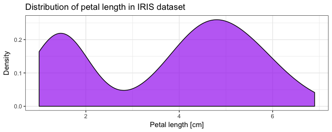
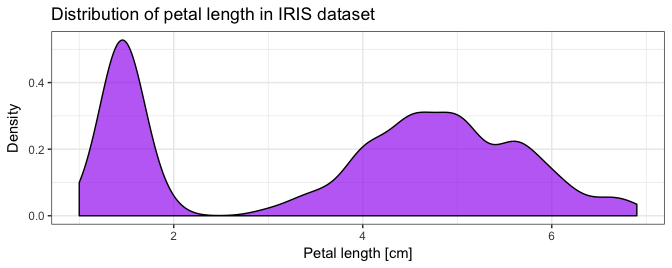

lez03a: Statistica descrittiva
================

-   [Il database "iris"](#il-database-iris)
-   [`summary()`](#summary)
-   [Un grafico](#un-grafico)
-   [Un grafico decente](#un-grafico-decente)
-   [Un bel grafico](#un-bel-grafico)
-   [Un bel grafico corretto](#un-bel-grafico-corretto)
-   [Un po' di magia](#un-po-di-magia)
-   [A proposito di ISTOGRAMMI](#a-proposito-di-istogrammi)
-   [La media](#la-media)

Il database "iris"
------------------

Uno dei dataset più utilizzati per la statistica è senza dubbio `iris`: la collezione di 150 misure di larghezza e lunghezza di petali e sepali di iris appartenenti a tre diverse specie:

``` r
iris
```

    ##     Sepal.Length Sepal.Width Petal.Length Petal.Width    Species
    ## 1            5.1         3.5          1.4         0.2     setosa
    ## 2            4.9         3.0          1.4         0.2     setosa
    ## 3            4.7         3.2          1.3         0.2     setosa
    ## 4            4.6         3.1          1.5         0.2     setosa
    ## 5            5.0         3.6          1.4         0.2     setosa
    ## 6            5.4         3.9          1.7         0.4     setosa
    ## 7            4.6         3.4          1.4         0.3     setosa
    ## 8            5.0         3.4          1.5         0.2     setosa
    ## 9            4.4         2.9          1.4         0.2     setosa
    ## 10           4.9         3.1          1.5         0.1     setosa
    ## 11           5.4         3.7          1.5         0.2     setosa
    ## 12           4.8         3.4          1.6         0.2     setosa
    ## 13           4.8         3.0          1.4         0.1     setosa
    ## 14           4.3         3.0          1.1         0.1     setosa
    ## 15           5.8         4.0          1.2         0.2     setosa
    ## 16           5.7         4.4          1.5         0.4     setosa
    ## 17           5.4         3.9          1.3         0.4     setosa
    ## 18           5.1         3.5          1.4         0.3     setosa
    ## 19           5.7         3.8          1.7         0.3     setosa
    ## 20           5.1         3.8          1.5         0.3     setosa
    ## 21           5.4         3.4          1.7         0.2     setosa
    ## 22           5.1         3.7          1.5         0.4     setosa
    ## 23           4.6         3.6          1.0         0.2     setosa
    ## 24           5.1         3.3          1.7         0.5     setosa
    ## 25           4.8         3.4          1.9         0.2     setosa
    ## 26           5.0         3.0          1.6         0.2     setosa
    ## 27           5.0         3.4          1.6         0.4     setosa
    ## 28           5.2         3.5          1.5         0.2     setosa
    ## 29           5.2         3.4          1.4         0.2     setosa
    ## 30           4.7         3.2          1.6         0.2     setosa
    ## 31           4.8         3.1          1.6         0.2     setosa
    ## 32           5.4         3.4          1.5         0.4     setosa
    ## 33           5.2         4.1          1.5         0.1     setosa
    ## 34           5.5         4.2          1.4         0.2     setosa
    ## 35           4.9         3.1          1.5         0.2     setosa
    ## 36           5.0         3.2          1.2         0.2     setosa
    ## 37           5.5         3.5          1.3         0.2     setosa
    ## 38           4.9         3.6          1.4         0.1     setosa
    ## 39           4.4         3.0          1.3         0.2     setosa
    ## 40           5.1         3.4          1.5         0.2     setosa
    ## 41           5.0         3.5          1.3         0.3     setosa
    ## 42           4.5         2.3          1.3         0.3     setosa
    ## 43           4.4         3.2          1.3         0.2     setosa
    ## 44           5.0         3.5          1.6         0.6     setosa
    ## 45           5.1         3.8          1.9         0.4     setosa
    ## 46           4.8         3.0          1.4         0.3     setosa
    ## 47           5.1         3.8          1.6         0.2     setosa
    ## 48           4.6         3.2          1.4         0.2     setosa
    ## 49           5.3         3.7          1.5         0.2     setosa
    ## 50           5.0         3.3          1.4         0.2     setosa
    ## 51           7.0         3.2          4.7         1.4 versicolor
    ## 52           6.4         3.2          4.5         1.5 versicolor
    ## 53           6.9         3.1          4.9         1.5 versicolor
    ## 54           5.5         2.3          4.0         1.3 versicolor
    ## 55           6.5         2.8          4.6         1.5 versicolor
    ## 56           5.7         2.8          4.5         1.3 versicolor
    ## 57           6.3         3.3          4.7         1.6 versicolor
    ## 58           4.9         2.4          3.3         1.0 versicolor
    ## 59           6.6         2.9          4.6         1.3 versicolor
    ## 60           5.2         2.7          3.9         1.4 versicolor
    ## 61           5.0         2.0          3.5         1.0 versicolor
    ## 62           5.9         3.0          4.2         1.5 versicolor
    ## 63           6.0         2.2          4.0         1.0 versicolor
    ## 64           6.1         2.9          4.7         1.4 versicolor
    ## 65           5.6         2.9          3.6         1.3 versicolor
    ## 66           6.7         3.1          4.4         1.4 versicolor
    ## 67           5.6         3.0          4.5         1.5 versicolor
    ## 68           5.8         2.7          4.1         1.0 versicolor
    ## 69           6.2         2.2          4.5         1.5 versicolor
    ## 70           5.6         2.5          3.9         1.1 versicolor
    ## 71           5.9         3.2          4.8         1.8 versicolor
    ## 72           6.1         2.8          4.0         1.3 versicolor
    ## 73           6.3         2.5          4.9         1.5 versicolor
    ## 74           6.1         2.8          4.7         1.2 versicolor
    ## 75           6.4         2.9          4.3         1.3 versicolor
    ## 76           6.6         3.0          4.4         1.4 versicolor
    ## 77           6.8         2.8          4.8         1.4 versicolor
    ## 78           6.7         3.0          5.0         1.7 versicolor
    ## 79           6.0         2.9          4.5         1.5 versicolor
    ## 80           5.7         2.6          3.5         1.0 versicolor
    ## 81           5.5         2.4          3.8         1.1 versicolor
    ## 82           5.5         2.4          3.7         1.0 versicolor
    ## 83           5.8         2.7          3.9         1.2 versicolor
    ## 84           6.0         2.7          5.1         1.6 versicolor
    ## 85           5.4         3.0          4.5         1.5 versicolor
    ## 86           6.0         3.4          4.5         1.6 versicolor
    ## 87           6.7         3.1          4.7         1.5 versicolor
    ## 88           6.3         2.3          4.4         1.3 versicolor
    ## 89           5.6         3.0          4.1         1.3 versicolor
    ## 90           5.5         2.5          4.0         1.3 versicolor
    ## 91           5.5         2.6          4.4         1.2 versicolor
    ## 92           6.1         3.0          4.6         1.4 versicolor
    ## 93           5.8         2.6          4.0         1.2 versicolor
    ## 94           5.0         2.3          3.3         1.0 versicolor
    ## 95           5.6         2.7          4.2         1.3 versicolor
    ## 96           5.7         3.0          4.2         1.2 versicolor
    ## 97           5.7         2.9          4.2         1.3 versicolor
    ## 98           6.2         2.9          4.3         1.3 versicolor
    ## 99           5.1         2.5          3.0         1.1 versicolor
    ## 100          5.7         2.8          4.1         1.3 versicolor
    ## 101          6.3         3.3          6.0         2.5  virginica
    ## 102          5.8         2.7          5.1         1.9  virginica
    ## 103          7.1         3.0          5.9         2.1  virginica
    ## 104          6.3         2.9          5.6         1.8  virginica
    ## 105          6.5         3.0          5.8         2.2  virginica
    ## 106          7.6         3.0          6.6         2.1  virginica
    ## 107          4.9         2.5          4.5         1.7  virginica
    ## 108          7.3         2.9          6.3         1.8  virginica
    ## 109          6.7         2.5          5.8         1.8  virginica
    ## 110          7.2         3.6          6.1         2.5  virginica
    ## 111          6.5         3.2          5.1         2.0  virginica
    ## 112          6.4         2.7          5.3         1.9  virginica
    ## 113          6.8         3.0          5.5         2.1  virginica
    ## 114          5.7         2.5          5.0         2.0  virginica
    ## 115          5.8         2.8          5.1         2.4  virginica
    ## 116          6.4         3.2          5.3         2.3  virginica
    ## 117          6.5         3.0          5.5         1.8  virginica
    ## 118          7.7         3.8          6.7         2.2  virginica
    ## 119          7.7         2.6          6.9         2.3  virginica
    ## 120          6.0         2.2          5.0         1.5  virginica
    ## 121          6.9         3.2          5.7         2.3  virginica
    ## 122          5.6         2.8          4.9         2.0  virginica
    ## 123          7.7         2.8          6.7         2.0  virginica
    ## 124          6.3         2.7          4.9         1.8  virginica
    ## 125          6.7         3.3          5.7         2.1  virginica
    ## 126          7.2         3.2          6.0         1.8  virginica
    ## 127          6.2         2.8          4.8         1.8  virginica
    ## 128          6.1         3.0          4.9         1.8  virginica
    ## 129          6.4         2.8          5.6         2.1  virginica
    ## 130          7.2         3.0          5.8         1.6  virginica
    ## 131          7.4         2.8          6.1         1.9  virginica
    ## 132          7.9         3.8          6.4         2.0  virginica
    ## 133          6.4         2.8          5.6         2.2  virginica
    ## 134          6.3         2.8          5.1         1.5  virginica
    ## 135          6.1         2.6          5.6         1.4  virginica
    ## 136          7.7         3.0          6.1         2.3  virginica
    ## 137          6.3         3.4          5.6         2.4  virginica
    ## 138          6.4         3.1          5.5         1.8  virginica
    ## 139          6.0         3.0          4.8         1.8  virginica
    ## 140          6.9         3.1          5.4         2.1  virginica
    ## 141          6.7         3.1          5.6         2.4  virginica
    ## 142          6.9         3.1          5.1         2.3  virginica
    ## 143          5.8         2.7          5.1         1.9  virginica
    ## 144          6.8         3.2          5.9         2.3  virginica
    ## 145          6.7         3.3          5.7         2.5  virginica
    ## 146          6.7         3.0          5.2         2.3  virginica
    ## 147          6.3         2.5          5.0         1.9  virginica
    ## 148          6.5         3.0          5.2         2.0  virginica
    ## 149          6.2         3.4          5.4         2.3  virginica
    ## 150          5.9         3.0          5.1         1.8  virginica

------------------------------------------------------------------------

la lunghezza dei petali può essere utilizzata come esempio di una tipica variabile continua misurata in campo:

è abbastanza chiaro che guardare i dati grezzi non ci porta da nessuna parte...

``` r
iris$Petal.Length
```

    ##   [1] 1.4 1.4 1.3 1.5 1.4 1.7 1.4 1.5 1.4 1.5 1.5 1.6 1.4 1.1 1.2 1.5 1.3
    ##  [18] 1.4 1.7 1.5 1.7 1.5 1.0 1.7 1.9 1.6 1.6 1.5 1.4 1.6 1.6 1.5 1.5 1.4
    ##  [35] 1.5 1.2 1.3 1.4 1.3 1.5 1.3 1.3 1.3 1.6 1.9 1.4 1.6 1.4 1.5 1.4 4.7
    ##  [52] 4.5 4.9 4.0 4.6 4.5 4.7 3.3 4.6 3.9 3.5 4.2 4.0 4.7 3.6 4.4 4.5 4.1
    ##  [69] 4.5 3.9 4.8 4.0 4.9 4.7 4.3 4.4 4.8 5.0 4.5 3.5 3.8 3.7 3.9 5.1 4.5
    ##  [86] 4.5 4.7 4.4 4.1 4.0 4.4 4.6 4.0 3.3 4.2 4.2 4.2 4.3 3.0 4.1 6.0 5.1
    ## [103] 5.9 5.6 5.8 6.6 4.5 6.3 5.8 6.1 5.1 5.3 5.5 5.0 5.1 5.3 5.5 6.7 6.9
    ## [120] 5.0 5.7 4.9 6.7 4.9 5.7 6.0 4.8 4.9 5.6 5.8 6.1 6.4 5.6 5.1 5.6 6.1
    ## [137] 5.6 5.5 4.8 5.4 5.6 5.1 5.1 5.9 5.7 5.2 5.0 5.2 5.4 5.1

`summary()`
-----------

*da non confondere con la funzione `summarise()` che vedremo tra poco*

``` r
summary(iris$Petal.Length)
```

    ##    Min. 1st Qu.  Median    Mean 3rd Qu.    Max. 
    ##   1.000   1.600   4.350   3.758   5.100   6.900

> -   `Min.`: il valore minimo
> -   `1st Qu`.: il primo **quartile** ossia il valore entro cui stanno il 25% dei dati
> -   `Median`: la mediana, *che è anche il secondo quartile*
> -   `Mean`: la **media aritmetica** dei valori **(non finisce qui)**
> -   `3rd Qu.`: il terzo **quartile**
> -   `Max.`: il valore massimo

------------------------------------------------------------------------

è uno strumento eccezionale per verificare che non ci siano errori nell'acquisizione dei dati:

``` r
summary(iris)
```

    ##   Sepal.Length    Sepal.Width     Petal.Length    Petal.Width   
    ##  Min.   :4.300   Min.   :2.000   Min.   :1.000   Min.   :0.100  
    ##  1st Qu.:5.100   1st Qu.:2.800   1st Qu.:1.600   1st Qu.:0.300  
    ##  Median :5.800   Median :3.000   Median :4.350   Median :1.300  
    ##  Mean   :5.843   Mean   :3.057   Mean   :3.758   Mean   :1.199  
    ##  3rd Qu.:6.400   3rd Qu.:3.300   3rd Qu.:5.100   3rd Qu.:1.800  
    ##  Max.   :7.900   Max.   :4.400   Max.   :6.900   Max.   :2.500  
    ##        Species  
    ##  setosa    :50  
    ##  versicolor:50  
    ##  virginica :50  
    ##                 
    ##                 
    ## 

------------------------------------------------------------------------

da notare che fornisce automaticamente anche le abbondanze dei dati che vengono immagazzinati come `factor`, quindi **variabili qualitative** in questo caso *non ordinate*

``` r
summary(iris$Species)
```

    ##     setosa versicolor  virginica 
    ##         50         50         50

Un grafico
----------

``` r
ggplot() +
    geom_density(data = iris, 
                 aes(x = Petal.Length))
```


Un grafico decente
------------------

``` r
ggplot() +
    geom_density(data = iris, 
                 aes(x = Petal.Length)) +
    theme_bw()
```


Un bel grafico
--------------

``` r
ggplot() +
    geom_density(data = iris, 
                 aes(x = Petal.Length),
                 fill = "purple",
                 alpha = 2/3) +
    theme_bw()
```


Un bel grafico corretto
-----------------------

``` r
ggplot() +
    geom_density(data = iris, 
                 aes(x = Petal.Length),
                 fill = "purple",
                 alpha = 2/3) +
    labs(title = "Distribution of petal length in IRIS dataset", 
         x = "Petal length [cm]", 
         y = "Density") +
    theme_bw()
```


Un po' di magia
---------------

``` r
ggplot() +
    geom_density(data = iris, aes(x = Petal.Length, fill = Species),
                 alpha = 2/3) +
    theme_bw()
```


------------------------------------------------------------------------

I due grafici non sembrano la somma uno dell'altro



------------------------------------------------------------------------

ma correggendo il valore `adjust=` tenendo conto che i valori sono il triplo:

``` r
ggplot() +
    geom_density(data = iris, 
                 aes(x = Petal.Length),
                 fill = "purple",
                 alpha = 2/3,
                 adjust = 1/3) + ### <<<---
    labs(title = "Distribution of petal length in IRIS dataset", 
         x = "Petal length [cm]", 
         y = "Density") +
    theme_bw()
```

------------------------------------------------------------------------



------------------------------------------------------------------------

Se esagero a stringere il valore inizia a vedersi la precisione della misura:


------------------------------------------------------------------------

In questo caso la visualizzazione più consueta è l'**istogramma di frequenza**

``` r
ggplot() +
    geom_histogram(data = iris, 
                   aes(x = Petal.Length),
                   color = "purple", fill = "purple",
                   alpha = 2/3) +
    theme_bw()
```


------------------------------------------------------------------------

la funzione `geom_histogram()` ci ricorda con un messaggio di scegliere la larghezza delle barre più adeguata:

``` r
ggplot() +
    geom_histogram(data = iris, 
                   aes(x = Petal.Length),
                   color = "purple", fill = "purple",
                   alpha = 2/3) +
    theme_bw()
```

    ## `stat_bin()` using `bins = 30`. Pick better value with `binwidth`.


------------------------------------------------------------------------

`?geom_histogram` ci fornisce qualche indicazione in più, anche se non è chiarissimo nella differenza fra il parametro `bins` e `binwidth`.

-   `bins` imposta il numero di barre
-   `binwidth` imposta la largezza delle barre stesse

------------------------------------------------------------------------

in questo caso i valori sono arrotondati al millimetro, `binwidth = 0.1`:

``` r
ggplot() +
    geom_histogram(data = iris, 
                   aes(x = Petal.Length),
                   color = "purple", fill = "purple",
                   binwidth = 0.1,
                   alpha = 2/3) +
    theme_bw()
```


------------------------------------------------------------------------


A proposito di ISTOGRAMMI
-------------------------

è molto pericoloso utilizzare un numero di barre diverso da quello originale.
In termini tecnici, se la variabile non è *veramente continua* ma è già ***binned***, cioè già riassunta in classi (che siano vere classi come le classi di diametro o che sia a causa di un arrotondamento) è fortemente sconsigliato il ***rebinning***, cioè un secondo raggruppamento in classi più ampie.

**Questa azione può generare più di un artefatto nei dati!**

------------------------------------------------------------------------

Anche l'istogramma può essere diviso:

``` r
ggplot() +
    geom_histogram(data = iris, 
                 aes(x = Petal.Length, 
                     fill = Species, color = Species),
                 alpha = 2/3, binwidth = 0.1) +
    theme_bw()
```


------------------------------------------------------------------------

O con le classiche barre affiancate (`position = "dodge"`)

``` r
ggplot() +
    geom_histogram(data = iris, 
                 aes(x = Petal.Length, fill = Species, color = Species),
                 alpha = 2/3, binwidth = 0.1, 
                 position = "dodge") + # <<<---
    theme_bw()
```


La media
--------

------------------------------------------------------------------------

[lez02](/lez02/) &lt;---&gt; [lez03b](/lez03b/)
