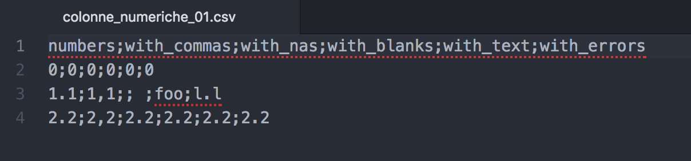

```{r setup, include=FALSE}
# knitr::opts_chunk$set(echo = TRUE)
```

## **tl.dr.**

Lettura di un file con problemi:

```{r}
data <- read.csv2("colonne_numeriche_01.csv")
str(data)
data
```

#### Trasformazione delle colonne non numeriche, **occhio!!! `warnings`!!!**

```{r}
library(magrittr)
wrong_cols <- c("numbers", "with_nas", "with_blanks", "with_text", "with_errors")
data[, wrong_cols] %<>% lapply(function(x) as.numeric(as.character(x)))
```

Controllo del risultato:

```{r}
str(data)
data
```

Come vedete vengono comunque fuori un sacco di magagne, il comando è **corretto se il database di partenza non ha problemi**, ma...

## Facciamo le cose a modino:

#### Il file `.csv`

È buona norma prima di caricare un file, controllare che faccia ha, nel modo più diretto possibile.  
Il mio editor di testo, [Atom](https://atom.io/), lo mostra così:

```{r, echo=FALSE, out.width = "500px"}

```

La prima riga è chiaramente composta dai nomi delle colonne (che sono 6), di seguito le 3 righe di dati.  
La seconda riga mostra chiaramente, o meno, una serie di problemi piuttosto comuni (che sono scritti anche nei nomi delle colonne):

* Decimali separati con il punto e con la virgola
* Valori mancanti (quello è una regola)
* Spazi bianchi (quasi impossibili da vedere, oppure altri caratteri che indicano dati mancanti)
* Annotazioni di testo inframmezzate ai numeri (anche quello è una regola)
* Lettere scritte per sbaglio al posto dei numeri: `o` anziché `0`, `1o` ancziché `10`, `l` al posto di `1`,  capita più spesso di quanto si possa pensare!

**NB:** la seconda colonna ha i decimali separati da virgola anche sulla terza riga, questo perché ci fosse stato il punto si sarebbe comportata esattamente come l'ultima colonna.

### Caricamento del file

Il file di partenza è quindi un normale `.csv`, separato da **punti e virgola** (_semicolon separated_).
La funzione standard per importarlo è `read.csv2`.

```{r}
data <- read.csv2("colonne_numeriche_01.csv")
str(data)
data
```

Come si vede, la funzione ha fatto un _casino_: ha automaticamente convertito gli _spazi_ in _NA_, e ok, ma ha trovato delle virgole, e ha immaginato che il file fosse nel tradizionale formato europeo, intrpretando il punto come testo. Le colonne in cui compare del testo, **compresi i punti** quindi sono convertite automaticamente in `factor`.

`tidyverse` ci offre una funzione con un rendiconto più esplicito di cosa sta succedendo, anche questa però fa un macello, perdendo i punti e inventandosi dei numeri!!

```{r}
library(tidyverse)
data <- read_csv2("colonne_numeriche_01.csv")
str(data)
data
```

Un buon sistema è:

## 1. importare tutte le colonne come testo:

```{r}
data <- read_csv2("colonne_numeriche_01.csv", 
                  col_types = paste(rep("c", ncol(data)), ### makes the "cccccc" string
                                    collapse = ""))
str(data)
knitr::kable(data)
```

## 2. convertire le colonne in `numeric`

**NB:** i dati vengono salvati in un altro database!

```{r}
library(magrittr)
data_numeric <- data
wrong_cols <- c("numbers", "with_commas", "with_nas", "with_blanks", "with_text", "with_errors")
data_numeric[, wrong_cols] %<>% lapply(function(x) as.numeric(as.character(x)))
```

```{r}
str(data_numeric)
data_numeric
```

Sono stati persi numerosi dati buoni, vediamo di recuperarli:

## 3. individuare i dati persi:

```{r}
unlist(data)[which(is.na(data_numeric))]
```

se ci sono troppi dati ripetuti possiamo usare la funzione `unique()`, ma perderemo l'informazione circa la colonna a cui il dato appartiene:

```{r}
unique(unlist(data)[which(is.na(data_numeric))])
```

## 4. sostituire i dati sbagliati con quelli giusti:

Un metodo semplice è farlo dato per dato:

```{r}
data_numeric[data == "1,1"] <- 1.1
data_numeric[data == "2,2"] <- 2.2
data_numeric[data == "l.l"] <- 1.1
```

```{r}
data_numeric
```

## 5. profit

Incassate i soldi!

---

<div align="center">
[Pagina dei TUTORIALS](../../tutorials/)
</div>

---

---

<div align="center">
[Torna al Syllabus](../../README.md)
</div>
---